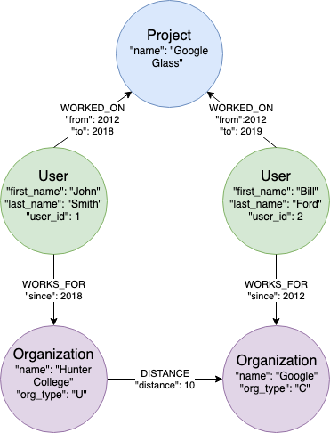
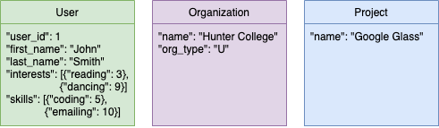

# Big Data by Justin Pacquing and Noam Sohn

## Expected Data in CSV:
### User:
* User_id, First_name, Last_name, Phone_number, Email
### Project:
* User_id, Project_name
### Interests:
* User_id, Interest, Interest_level
### Skills:
* User_id, Skill, Skill Level
### Organizations
* User_id, Organization, Organization_type
### Distance:
* Organization 1, Organization 2, Distance

## Diagrams and Explanations:
### Neo4j Database:

#### Our Neo4j Database has 3 types of Entities
* Users
  * The registered users of the Application
  * Users have three properties:
    * 'first_name': the user's first name
    * 'last_name': the user's last name
    * 'user_id': the unique identifier of a user from the loaded user csv

* Organizations
  * The organizations users work for
  * Organizations have two properties:
    * 'name': the name of the organization
    * 'org_type': the type of organization
      * Possible Value of 'org_type' are:
        * 'U': University
        * 'C': Company
        * 'G': Government

* Projects
  * The projects users have worked on
  * Projects have one property:
    * 'name': the name of the project

#### Our Neo4j Database has 3 types of Relationships
* WORKS_FOR
  * Connects User --> Organization
  * Describes what organization a user works for
  * Has one property:
    * 'since': the year the user started working

* WORKED_ON
  * Connects User --> Project
  * Describes what project(s) a user worked on
  * Has two properties:
    * 'from': the year the user started working on the project
    * 'to': the year the user last worked on the project

* DISTANCE
  * Connects Organization --> Organization
  * Describes how far an organization is from another
  * Has one property:
    * 'distance': the distance between two organizations

### MongoDB Database

#### Collections
* Users
  * The registered users of the Application
  * Each User document has five fields:
    * 'first_name': the user's first name
    * 'last_name': the user's last name
    * 'user_id': the unique identifier of a user from the loaded user csv
    * 'skills': an array of documents each containg a user skill as a field and the weight of that skill as the value
    * 'interests': an array of documents each containg a user interest as a field and the weight of that interest as the value

* Organizations
  * The organizations users work for
  * Each Organization document have two fields:
    * 'name': the name of the organization
    * 'org_type': the type of organization
      * Possible Value of 'org_type' are:
        * 'U': University
        * 'C': Company
        * 'G': Government

* Projects
  * The projects users have worked on
  * Each Project document have one field:
    * 'name': the name of the project

## Options Queries:
##

# All queries
* **'trusted'**: Given an origin_id, number of interests to query for, and the list of queries, trusted returns the list of trusted colleagues of colleagues. It searches through the origin_id's colleagues and then finds their colleagues, afterwards it searches through that list and determines if they have the any of the interests that the origin_id requested, if so it is returned.
* **'user'**: Given a user_id, returns the user information from MongoDB. If teh user does not exists, returns error message.
* **'nearby'**: Given a user_id, nearby returns the list of users within LAKSJF:LASKFJASL:FKJSAL:FKJASFL:KJ
* **'org'**: Given the name of the organization, returns the details of the organization. If no organization exists, returns an error message.
* **'help'**: Prints a list of the available queries and a brief description.
* **'quit' or 'q'**: Exits the program

# Potential improvements
* Add additional information for each entity
* Be able to create/delete/modify entities from the command line
Our databases are expecting the information to be provided in a reasonable format, however, big data does not always function in that way; we could enhance the system by allowing for 'incomplete' data to be stored in Mongo/Neo4j. Furthermore, when searching for an item, if one searched for "Hunter" instead of "Hunter College" the system will return that it does not have any nodes with "Hunter" an update we could implement would be to allow for incomplete searches to return information and clarify if that was the result the user was expecting when they searched for the shortcut term.
